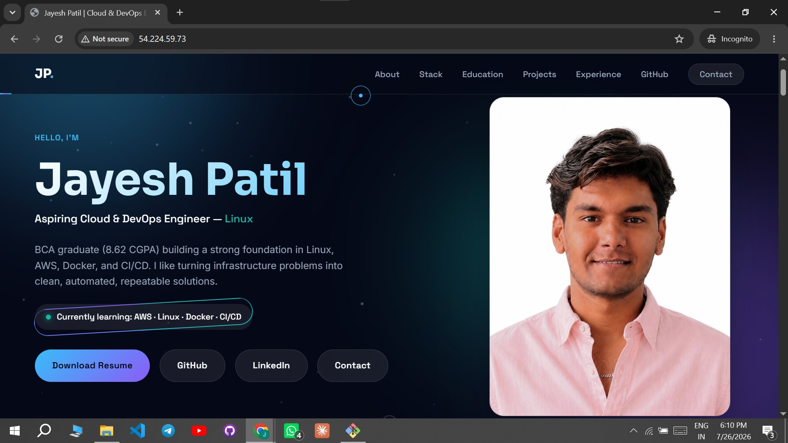
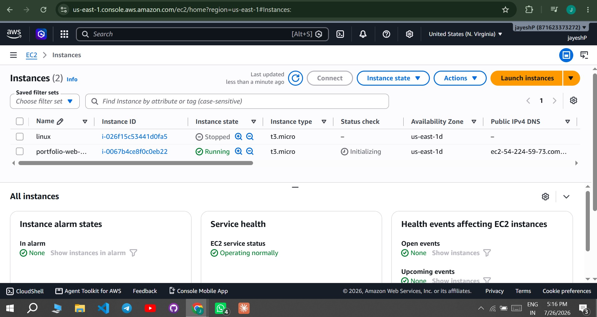
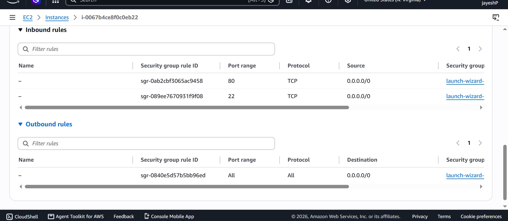
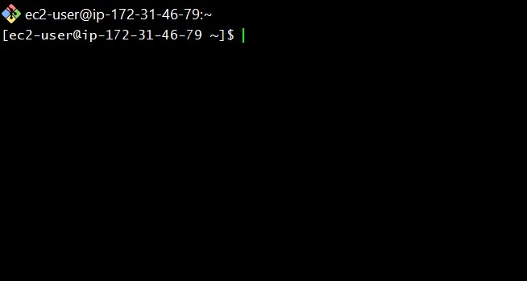
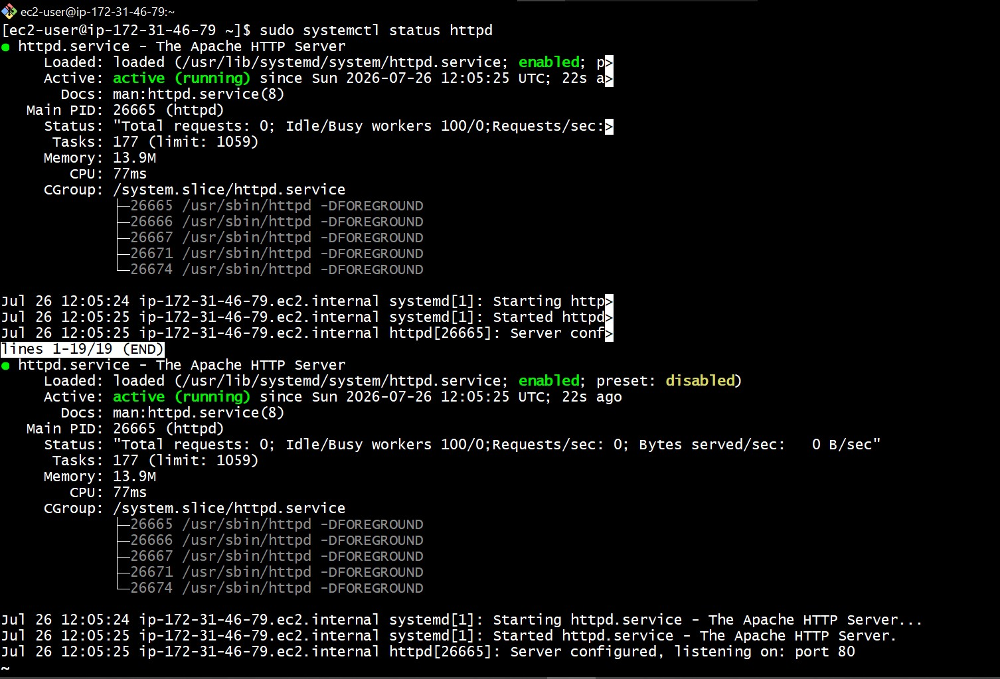

# 🌐 Jayesh Patil – Portfolio Website

<p align="center">
  
</p>

<p align="center">
  <strong>A modern, responsive portfolio website showcasing my Cloud & DevOps journey.</strong>
</p>

<p align="center">
  <a href="https://jayeshp031.github.io/portfolio/">🌍 Live Website</a> •
  <a href="https://github.com/JayeshP031">💻 GitHub</a> •
  <a href="https://www.linkedin.com/in/jayesh-patil-772332288/">🔗 LinkedIn</a>
</p>

---

# 📖 About the Project

This repository contains the source code for my personal portfolio website.

The website is built using **HTML, CSS, and JavaScript** and deployed on **AWS EC2 (Amazon Linux 2023)** using the **Apache HTTP Server**.

The goal of this project is to demonstrate both frontend development skills and practical cloud deployment experience.

---

# 🚀 Live Demo

**Website:**  
jayeshp031.github.io/portfolio/

---

# 🏗️ Deployment Architecture

```text
User Browser
      │
      ▼
Public IPv4 Address
      │
      ▼
AWS EC2 Instance
(Amazon Linux 2023)
      │
      ▼
Apache HTTP Server (httpd)
      │
      ▼
Portfolio Website
```

---

# 🛠️ Technologies Used

## Frontend

- HTML5
- CSS3
- JavaScript

## Cloud

- AWS EC2
- Amazon Linux 2023
- Apache HTTP Server

## Tools

- Git
- GitHub
- VS Code
- Git Bash

---

# ✨ Features

- Responsive Design
- Modern UI
- Mobile Friendly
- Smooth Scrolling
- Project Showcase
- Skills Section
- Contact Section
- Resume Download
- Fast Loading
- AWS Hosted

---

# 📂 Project Structure

```text
portfolio/
│
├── assets/
│
├── docs/
│   └── screenshots/
│
├── index.html
├── style.css
├── script.js
├── favicon.ico
├── robots.txt
├── sitemap.xml
├── README.md
├── LICENSE
└── .gitignore
```

---

# ☁️ AWS Deployment Steps

1. Launch an EC2 instance using Amazon Linux 2023.
2. Configure Security Groups (SSH and HTTP).
3. Connect to the instance using SSH.
4. Update the system packages.
5. Install Apache HTTP Server.
6. Enable and start the Apache service.
7. Upload the portfolio files.
8. Copy files to `/var/www/html`.
9. Set proper ownership and permissions.
10. Access the website using the EC2 public IP.

---

# 📸 Project Screenshots

## Portfolio Homepage


---

## EC2 Instance



---

## Security Group



---

## SSH Connection



---

## Apache Running



---

# 📚 Key Learning Outcomes

- Linux command-line administration
- AWS EC2 provisioning
- Apache HTTP Server configuration
- SSH remote access
- Website deployment
- File permissions and ownership
- Git version control
- GitHub repository management

---

# 🔮 Future Improvements

- Deploy using a custom domain
- Configure HTTPS with SSL
- Add GitHub Actions for automated deployment
- Deploy behind a reverse proxy
- Improve performance and accessibility

---

# 👨‍💻 Author

**Jayesh Patil**

- GitHub: https://github.com/JayeshP031
- LinkedIn: https://www.linkedin.com/in/jayesh-patil-772332288/
---

# 📄 License

This project is licensed under the MIT License.
